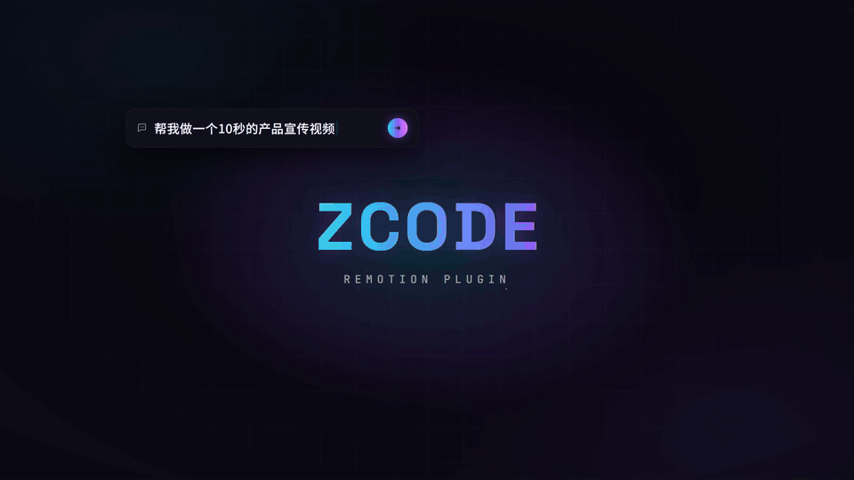

# Remotion for ZCode

[](https://github.com/AIwork4me/zcode-remotion/actions/workflows/ci.yml)
[](LICENSE)
[](CHANGELOG.md)
[](https://zcode.z.ai/cn/docs/plugin)

**One prompt from idea to MP4.**
**The reliability layer for Remotion on ZCode.**

One prompt → official Remotion skills → environment preflight → visual QA → verified MP4.

[ZCode](https://zcode.z.ai) is an AI coding agent; [Remotion](https://www.remotion.dev) makes
videos with React. Remotion ships excellent official Agent Skills — this plugin doesn't replace
them. It orchestrates them inside ZCode, reliably: it bootstraps the official skills, pre-flights
the environment, gates every render on an agent-inspected representative still, verifies the output, and keeps
watch on upstream compatibility so the workflow keeps working as Remotion evolves.

**English** · [简体中文](README.zh-CN.md)



Watch the full 23s demo: [docs/assets/demo.mp4](docs/assets/demo.mp4) · project source: [demo/](demo/)

> **Yes — this demo was made by the plugin itself.** One prompt, no manual edits.
> The video shows its own birth: a single prompt travels through code → timeline →
> render → finished film (「一句话，一部片」).

## See it happen

```text
You:    帮我做一个10秒的产品宣传视频，主题是 ZCode Remotion Plugin
Agent:  ✅ loads the remotion skill → bootstraps the official Remotion skills
        ✅ scaffolds the project (package manager auto-detected)
        ✅ writes the scenes → renders a representative still and visually checks it
        ✅ fixes issues if needed → renders the final MP4 → verifies the output
You:    （23 minutes later, zero intervention）🎉
```

## Why zcode-remotion?

The obvious question: *why not just install the official Remotion skills directly?*
You can — and then you own the glue: installing, environment checks, render gates,
version drift. That glue is this plugin. **We don't replace Remotion's official
skills. We make them reliable inside ZCode.**

| Capability | Official Remotion skills | zcode-remotion |
|---|---|---|
| Remotion domain knowledge | Yes | Uses the official skills |
| Official skills bootstrap | Manual (official CLI) | Automatic inside the ZCode workflow |
| ZCode-native natural-language trigger | — | Yes |
| Chinese + English routing validation | — | Tested |
| Environment preflight | — | Yes |
| Package-manager detection | — | Yes |
| Automated still-frame visual QA gate | — | Yes (agent-inspected, autonomous) |
| Render output verification | — | Yes |
| `/remotion-doctor` | — | Yes |
| Upstream compatibility monitoring | — | Yes (daily, with validated auto-PRs) |
| ZCode real-client E2E evidence | — | Historical journey evidence; current CI compatibility evidence linked ([report](docs/verification-report.md)) |

## Install

1. In ZCode, open **Settings → Plugins** (a workspace must be open), click
   **Create → Add plugin marketplace**, and paste this repo:
   `https://github.com/AIwork4me/zcode-remotion`
2. Install and enable the **remotion** plugin.
3. Just ask — `帮我做一个 10 秒的产品宣传视频` — or run `/remotion-setup` first.

Requires Node ≥ 18 ([get it here](https://nodejs.org)). Works on Windows / macOS / Linux.

Plugin components (this plugin's skill and `/remotion-*` commands) register
automatically on install. The official Remotion skills are installed externally:
per the current ZCode docs, open **Settings → Skills**, click **Refresh**, and
confirm they are listed and enabled. If they still do not appear, start a new
conversation.

## What you get

| Piece | What it does |
|---|---|
| `remotion` skill | Auto-triggers on video requests (Chinese or English); bootstraps official skills, pre-flights the environment, routes to the right official skill |
| `/remotion-setup` | Installs the official Remotion skills via the official installer (user scope by default; `--project` to pin to one repo) + verifies discovery on disk |
| `/remotion-doctor` | Environment health check: Node, package manager, skills, installed-vs-latest versions, consistency, Chrome Headless Shell — ends with X/8 checks and one fix command |
| `/remotion-update` | Upgrades via the official path (`npx remotion upgrade`, or the official manual fallback) + refreshes official skills + verifies consistency |

## How it works

```text
 you ask for a video ──▶ remotion skill (this plugin's reliability layer)
                          │  1. bootstrap gate ──▶ official skills installer
                          │  2. environment pre-flight (node / package manager / platform)
                          │  3. route to the right official skill ──┐
                          ▼                                       ▼
                still-frame gate (Agent visual QA)    Remotion's official skills
                          │                            create · markup · studio · render
                          ▼                                       │
                full render ──▶ output verified ──────────────────┘
```

The plugin **never vendors Remotion's content** — official skills are fetched by your
machine through Remotion's official installer, so you always get the latest and the
license stays between you and Remotion (free for individuals and companies ≤3 employees,
see [NOTICE.md](NOTICE.md)).

## Showcase

Made something with zcode-remotion?
Share your video in [GitHub Discussions → Show and tell](https://github.com/AIwork4me/zcode-remotion/discussions).

## Troubleshooting

| Symptom | Fix |
|---|---|
| `npx skills add` fails | Check `node -v` ≥ 18 and network, retry; network/cache recovery ladder in the remotion skill |
| Chrome/Chromium download failure | Network/proxy blocking — see [chrome-headless-shell docs](https://www.remotion.dev/docs/chrome-headless-shell) |
| `Could not find composition with ID …` | The `<Composition id>` must match the CLI argument |
| `delayRender() … timed out` | Every `delayRender` needs a `continueRender` |
| `Module not found` | Run your package manager's install; check the lockfile |
| Anything else | `/remotion-doctor`, then the official `remotion-docs` skill |

## Licensing

- Plugin code/content: [MIT](LICENSE)
- Official Remotion skills: Copyright Remotion, Remotion License — free for individuals
  and companies ≤3 employees; larger companies need a license ([remotion.pro](https://www.remotion.pro))

Tested against: Remotion `4.0.520` · official skills `4.0.520` — baseline tracked in
[compatibility/remotion.json](compatibility/remotion.json), verification evidence in
[docs/verification-report.md](docs/verification-report.md).

## Contributing

PRs welcome — see [CONTRIBUTING.md](CONTRIBUTING.md). The gate is two commands:
`node --test scripts/verify-plugin.test.mjs && node scripts/verify-plugin.mjs --offline`.

If this plugin saved you an afternoon of video editing, a ⭐ helps others find it.
